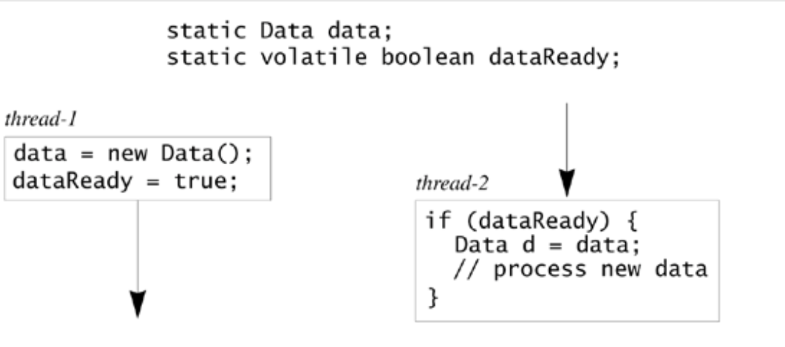

+++
title = "6. Visibility"
date = "2025-01-12"
tags = [
    "markdown",
    "syntax",
]
+++

# Visibility

A field, or a variable accordingly to what called `memory model` followed by `Java Programming` might have a set of 
values that can be returned, which might be counterintuitive to developers. For example, consider this code

#### A thread which modify the field
```java
public void updateCurrent() {
    currentValue = (int) Math.random();
}
```

#### UI thread
```java
currentValue = 5;
for (;;) {
    display.showValue(currentValue);
    Thread.sleep(1000); // wait 1 second
}
```

In the above code, the write thread might add a lot of values that can be returned to the field `currentValue`. In
this case, `memory model` will choose to return the initial values because it didn't detect any method of the
UI thread modify `currentValue`, which results in values modified are not updated on the UI thread, meaning not 
visible.

To make it visible, there are two methods:
1. Wrap code with `synchronized` method or block.
2. Declare the field as `volatile`.

## The happens-before relationship
In the following image, although the `data` references are not synchronized, read from **thread-2** still see
data updated from **thread-1** if `dataReady` return `true`. This is because the `dataReady` is volatile. This
phenomenon is called `happens-before`. The order of execution of threads, might affect the visibility of a variable 
from another thread.



## Final fields and security
There is a myth among developers that a final field doesn't need to be synchronized, because they assume that the initialization of the field done by one thread synchronizes with the reading process done by another thread. This is not be the case
, therefore synchronization tools must be used here to ensure visibility.